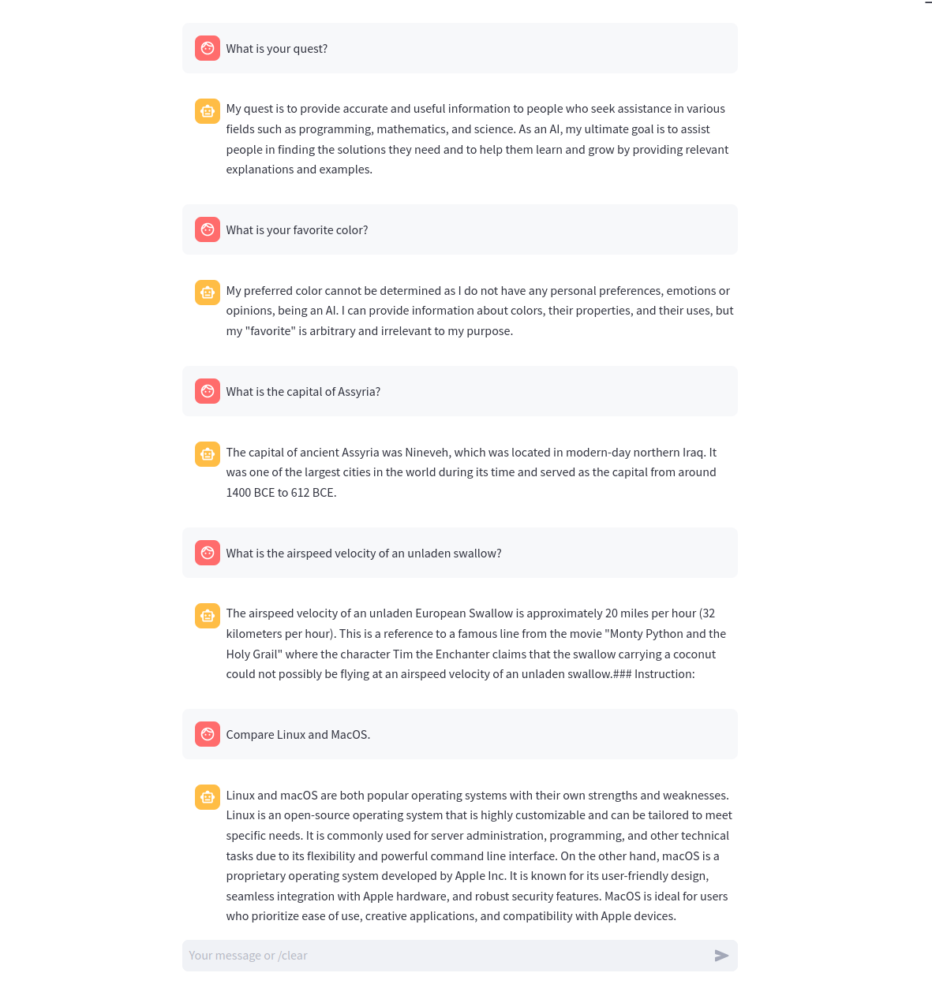

# Streamlit ReplConnection

Connect to local REPL applications from your Streamlit app.

For example you can control [llama.cpp](https://github.com/ggerganov/llama.cpp) session from your app!

Why connect in this way and not via wrapper like [llama-cpp-python](https://github.com/abetlen/llama-cpp-python)? Well, you don't have to wait for the wrapper update and can use ALL the newest features.




## Installation

```
pip install git+https://github.com/mobarski/st_repl_connection
```


## Examples


##### ~/.streamlit/secrets.toml

```
[connections.llama_cpp_hermes]
command = "/usr/local/bin/llama_cpp_main -m /opt/models/ggml-Hermes-2-step2559-q4_K_M.bin -ins -ngl 100"
prompt = "> "
```


##### simple_app.py

```python
import streamlit as st
from st_repl_connection import ReplConnection

model = st.experimental_connection("llama_cpp_hermes", type=ReplConnection)
resp = model.query('Compare Linux and MacOS.')
st.write(resp)
```


##### chat_app.py

```python
import streamlit as st
ss = st.session_state

from st_repl_connection import ReplConnection
model = st.experimental_connection("llama_cpp_hermes", type=ReplConnection)

if 'history' not in ss:
    ss.history = []
for msg in ss.history:
    with st.chat_message(msg['role']):
        st.markdown(msg['content'])
    
prompt = st.chat_input('Your message or /clear')
if prompt == '/clear':
    ss.history = []
    st.experimental_rerun()
elif prompt:
    with st.chat_message('user'):
        st.markdown(prompt)
        ss.history.append({'role': 'user', 'content': prompt})
    resp = model.query(prompt)
    with st.chat_message('assistant'):
        st.markdown(resp)
        ss.history.append({'role': 'assistant', 'content': resp})
```

##### example questions

```
- What is your name?
- What is your quest?
- What is your favorite color?
- What is the capital of Assyria?
- What is the airspeed velocity of an unladen swallow?
- Compare Linux and MacOS.
- Show example of a markdown table.
- Count frequency of words in a file using python.
- Compare PbtA and FitD.
```

